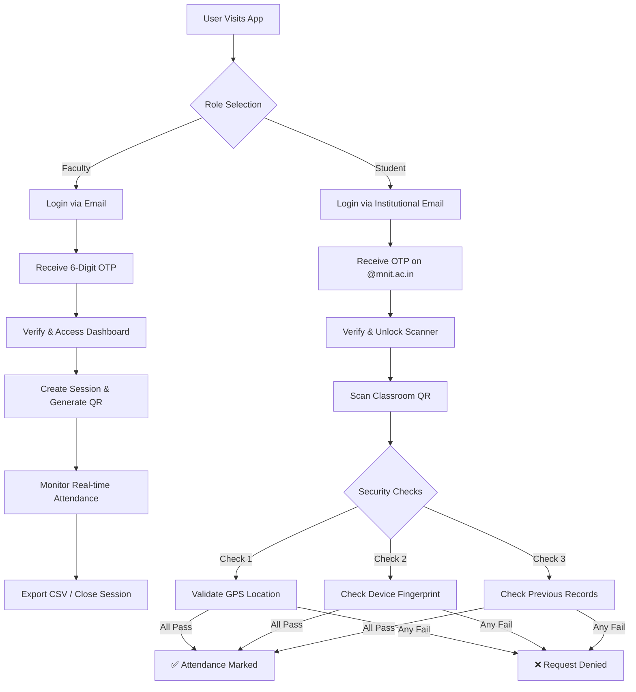

# 🎓 QR-Based Secure Attendance System


A next-generation, secure, and location-aware attendance system designed to eliminate proxy attendance through multi-layer verification. Built for educational institutions with strict identity and location enforcement.

---

## 🌐 Live Deployment

| Component | Status | URL |
|-----------|--------|-----|
| **Frontend (App)** | 🟢 Online | **[Launch Application](https://qr-based-attendance-system-hazel.vercel.app)** |
| **Backend (API)** | 🟢 Online | [Check Health Status](https://qr-based-attendance-system-jw2v.onrender.com/api/health) |

---

## 🛡️ Key Security Features (Why We Win)

This isn't just a QR scanner; it's a **fortress against proxy attendance**.

### 1. 🔐 OTP-Based Identity Verification
- **Faculty**: Authenticated via email OTP to create and manage sessions. Only the creator can close or export their sessions.
- **Students**: Must verify their **Institutional Email (@mnit.ac.in)** via OTP before they can access the scanner. No external emails allowed.

### 2. � Single Device Lock (Anti-Proxy)
- **The "One Device, One Student" Rule**: We use browser fingerprinting to lock a student's identity to their physical device.
- **Duplicate Prevention**: If a student tries to mark attendance for a friend using their own phone (logging out and logging in as the friend), the system **detects the device ID again and BLOCKS the attempt**.

### 3. 📍 Geofencing & GPS Validation
- **Location Check**: Students typically must be within **50 meters** (configurable of the classroom to mark attendance.
- **Haversine Formula**: Precise distance calculation between the faculty's device and the student's device.

### 4. 🚫 Session Ownership & Integrity
- **Role-Based Access**: Faculty dashboard is completely separated from Student view.
- **Secure Exports**: Only the faculty member who *created* the session can download the CSV report.

---

## 🔄 System Architecture & Flow

### User Journey Flow



---

## 📦 Tech Stack

### Frontend
- **React 18 + Vite**: Blazing fast UI.
- **HTML5-QRCode**: Reliable in-browser camera access.
- **CSS3 Variables**: Modern, responsive design without heavy frameworks.

### Backend
- **Node.js + Express**: Robust REST API.
- **JWT (JSON Web Tokens)**: Stateless, secure authentication.
- **Resend / Brevo**: Transactional email delivery infrastructure.
- **Google Sheets API**: Using simpler, accessible storage as a database (NoSQL-like usage).

---

## 🛠️ Local Setup Guide

If you want to run this locally instead of using the live links:

### 1. Clone & Install
```bash
git clone https://github.com/2024ucp1505/QR-Based-Attendance-system.git
cd QR-Based-Attendance-system
```

### 2. Backend Setup
```bash
cd server
npm install

# Create .env file with your credentials
# (See .env.example for required keys)
npm run dev
```

### 3. Frontend Setup
```bash
cd client
npm install
npm run dev
```

---

## � License
MIT License. Built with ❤️ for the C2C Mock Hackathon.
